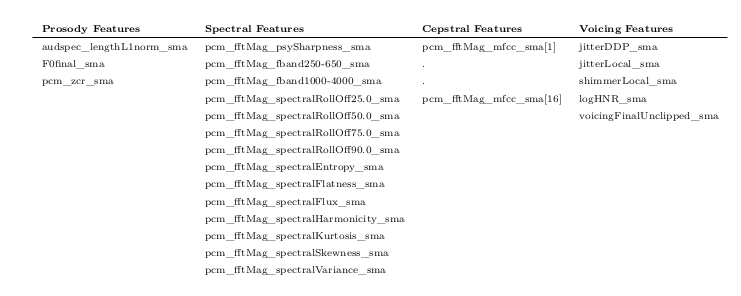

## Description of Dataset used for TTS-Evaluation using Learning-Based Objective Evaluation Framework

### 1. TTS-Models Generation (on [IITM](https://www.iitm.ac.in/donlab/tts/database.php) & [CMU](http://festvox.org/h2r_indic/cmu_indic_hin_ab.tar.bz2) TTS datasets):
  * MARYTTS-USS : [MarryTTS 5.2](https://github.com/marytts/marytts/releases/tag/v5.2)
  * MARYTTS-HMM : [MarryTTS 5.2](https://github.com/marytts/marytts/releases/tag/v5.2)
  * Merlin-DNN : [World_Merlin](https://github.com/pbaljeka/world_merlin)
  * Festvox-CLU : [CLUSTERGEN](https://github.com/festvox/festival)

### 2. Feature Extraction:
  * Label the **\*.wav** of all the models including the original wave files of the corresponding dataset in terms of phoneme, syllable, word.
  * [unified-parser](https://www.iitm.ac.in/donlab/tts/unified.php) has been used to label & extract the syllables from the wave files.
  * Rules of splitting a wave file into words, syllables and phonemes were written into TextGrid files with the help of [TextGridTools](https://textgridtools.readthedocs.io/en/stable/).
  * The wave files are split into phonemes, syllables and words.
  * Desired Feature-set is extracted using the [OpenSMILE](https://www.audeering.com/opensmile/) toolkit.

### 3. List of Proposed Features:
  

### 4. Data Description:
  * Features are extracted over Phonemes, Syllables and Words of all the TTS-models separately for each speech corpus, e.g. CMU and IITM.
  * Data directory consists of **CMU** and **IITM** subdirectories. Each has three separate subdirectories for **Phoneme**, **Syllable** and **Word**.
  * All the three subdirectories finally consists of 5 subdirectories corresponding to each TTS-Model, e.g. HMM, CLU, DNN, USS as well as ORIG (Human speech).
  * These TTS-Model directories (CMU_HMM, IITM_HMM etc.) actually contains the unit-wise 76 features in a **\*.csv** file.
